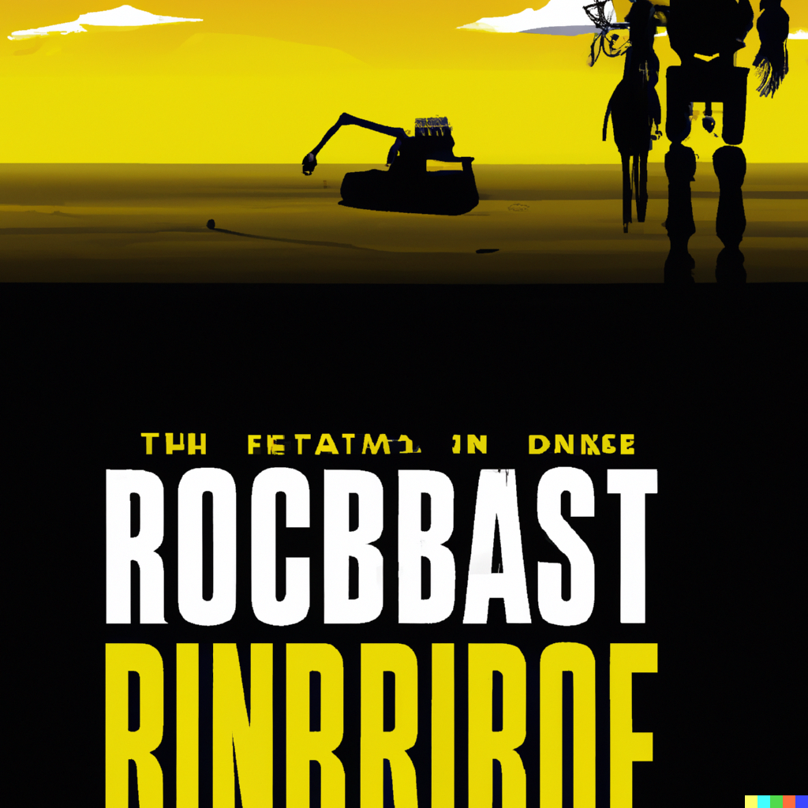

# Report by Jeff & Aidan

## Data

For our project, we ended up using two sets of data, the first of them we ended up disgarding, as it did not produce an output that we were satisfied with. We got this data from various subtitle websites like, `subtitlist.com`, `elsubtitle.com`, and `SRTFiles.com`. As for the data that we ended up using to generate our output, this was actual synopses of movies, instead of subtitles. This allowed for better output as it was actually synopsis data, instead of subtitles that included numbers, symbols, and sounds. We got all of these synopses from `IMDB.com`, as all of the movies we used had synopses available on this site.

## Text Generation

We followed the instructor provided tutorial [here, on Tensorflow](https://www.tensorflow.org/text/tutorials/text_generation#build_the_model), making some adjustments where necessary. Those adjustments include (but aren't limited to) tweaking the process of collecting the input file, *heavily* increasing the number of training epochs, and adjusting the starting characters when creating a new prediction.

```
The story takes place in the future where the greenhouse gases have caused the polar icecaps to melt, with the rest of the robot childs and gives him the bad news that his estimate of years is now down to days before hereve codes with the apsears in video clips behind the black hole Gquan't stand till be a trap.
```

```
MODIFIED VERSION:
The story takes place in the future where the greenhouse gases have caused the polar icecaps to melt. The robot children give the bad news that the estimate of years is now down to days before the code will appear in video clips to make the black hole a trap.
```

## Supplemental Production

The supplemental production was created through the use of DALL-E. We asked for a movie poster for a movie about a climate disaster brought about by robot children. The stark yellow-and-black coloring and the pictured barren wasteland definitely convey the feeling we were hoping to see. The looming robot hand in the corner of the poster is a particularly nice touch.



## Analysis

Our generated text is *much* better than our initial attempt. We initially used subtitle files from 11 different movies, and the resulting text--no matter how much we tweaked the number of epochs--was always incoherent, probably because the contents of those 11 movies varied *drastically* (compare the dialogue, or lack thereof, in *WALL-E* to something like *Soylent Green*). We pivoted and went with synopsis files for the same 11 movies, hoping that more similarly structured content would help keep some semblance of consistency and coherence in the generated text.

This was a *major* improvement, but only after *severely* cranking up the number of training epochs. Since the input text was much, *much* smaller, we had to iterate through the training process over 100 times more to achieve results that were satisfactory and showed losses similar to the generation using the massive subtitle file.

## Carbon Footprint

The carbon footprint of our text generation implementation is most likely insignificant due to the size and scale of our model. Our input file is only around 300 lines long, and we hit the sweet-spot at around 150 epochs. This, compared to the supercomputers that train models hundreds of times the size, is nothing. However, this does not mean the implication is still concerning. This, overall, was fairly simplistic to implement, and although computers like our do not lead to the same emissions as supercomputers, having the ability to lead to a substantial amount of emissions at such little physical overhead is concerning for the environment. Companies that have access to the infrastructure to run and maintain a supercomputer are essentially able to release substantial amounts of carbon into the atmosphere whenever they please, due to how simplified AI and machine learning has become. Many of the most popular AI models being used today do not directly make strides to solving the climate crisis, but instead hone in on making the most sophisticated text, or image, based generation model ever. The desire for accuracy seems to be overshadowing the urgent need for potential solutions, which, ethically, is extremely concerning for citizens around the world.

## Challenges and Learning Experiences

Some challenges we encountered during our work on this lab inculde managing our input data, as well as tweaking our model in slight ways to allow for the best text generation possible. As for our input data, we ran into a problem with our first iteration, as it was subtitle data filled with numbers, time-stamps, symbols, and sounds. This caused us to make a choice to either, parse through the thousands of lines of subtitle data and attempt to clean it up perfectly, or to just roll with it. We decided to just use the raw subtitle data, but it led to an undesireable output. To combat this, we ended up completely changing our input data to something more manageable. The tweaks to out model were a bit frustrating, as it was hard to find the sweet-spot what ended with the best loss possible. Because of this, however, we both ended up becoming more familiar with overfitting and underfitting, as well as the entire process of running data through a NN.